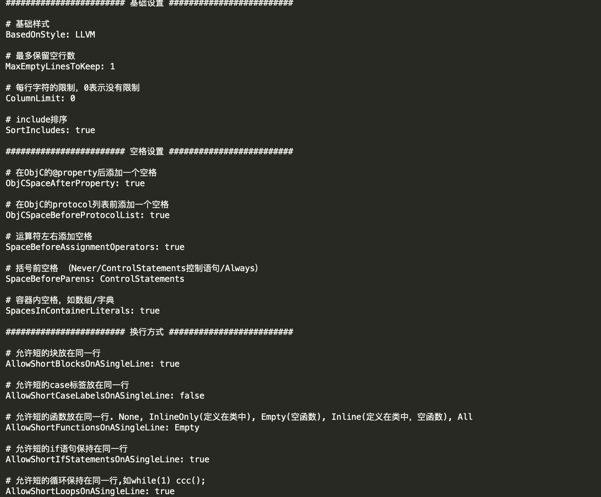
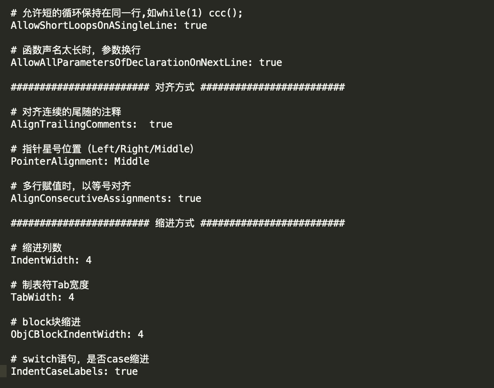

# AUTO_FORMAT

详情请参考：<http://clang.llvm.org/docs/ClangFormatStyleOptions.html>

---

指令集|描述|可取值
---|---|---
DisableFormat|选择是否关闭格式化工具| ture\false
BasedOnStyle|选择代码风格|LLVM、Google、Chromium、Mozilla、WebKit
AccessModifierOffset|修饰符偏移量(在OC中没有什么表现形式)|int
AlignAfterOpenBracket|开括号(开圆括号、开尖括号、开方括号)后的对齐|Align、 DontAlign、 AlwaysBreak
AlignConsecutiveAssignments|对齐连续行的复制运算符|ture、false
AlignConsecutiveDeclarations|对齐连续声明（不推荐使用，可能会导致格式化失败）|ture、false
AlignEscapedNewlinesLeft|对齐逃脱换行(使用反斜杠换行)的反斜杠(ture:左对齐，false:右对齐)|ture、false
AlignOperands|水平对齐二元和三元表达式的操作数|ture、false
AlignTrailingComments|尾部注释是否对齐|true、false
AllowAllParametersOfDeclarationOnNextLine|允许函数声明的所有参数在放在下一行|ture、false
AllowShortBlocksOnASingleLine|允许短的块放在同一行(例如简单的语句判断)|ture、false
AllowShortCaseLabelsOnASingleLine|允许短的case标签放在同一行|ture、false
AllowShortFunctionsOnASingleLine|允许短的函数放在同一行|None, InlineOnly(定义在类中), Empty(空函数), Inline(定义在类中，空函数), All
AllowShortIfStatementsOnASingleLine|允许短的if语句保持在同一行|true、false
AllowShortLoopsOnASingleLine|允许短的循环保持在同一行|true、false
AlwaysBreakAfterDefinitionReturnType|函数定义返回类型破坏样式使用(慎用)|true、false
AlwaysBreakBeforeMultilineStrings|总是在多行string字面量前换行|true、false
BinPackArguments|false表示函数实参要么都在同一行，要么都各自一行|true、false
BinPackParameters|false表示函数形参要么都在同一行，要么都各自一行|true、false
BreakBeforeBinaryOperators|二元运算符格式化方式|None(在操作符后换行), NonAssignment(在非赋值的操作符前换行), All(在操作符前换行)
BreakBeforeBraces||默认custom
BreakBeforeTernaryOperators|在三元运算符前换行|true、false
BreakConstructorInitializersBeforeComma|在构造函数的初始化列表的逗号前换行|true、false
ColumnLimit|每行字符的限制，0表示没有限制|0
ConstructorInitializerAllOnOneLineOrOnePerLine|构造函数的初始化列表要么都在同一行，要么都各自一行|true、false
ConstructorInitializerIndentWidth|构造函数的初始化列表的缩进宽度|4
ContinuationIndentWidth|代码块换行的缩进距离|20?
IndentCaseLabels|缩进case标签|true、false
IndentWidth|缩进距离|4
KeepEmptyLinesAtTheStartOfBlocks|保留在块开始处的空行|true、false
Language|格式模板（默认推荐Cpp、Objc可能会出现意想不到的问题）|None、Cpp、ObjC
MaxEmptyLinesToKeep|连续空行的数量|1
NamespaceIndentation|命名空间缩进|None, Inner(缩进嵌套的命名空间中的内容), All
ObjCBinPackProtocolList|控制代理是否折行显示|值暂未知
ObjCBlockIndentWidth|使用ObjC块时缩进宽度|4
ObjCSpaceAfterProperty|在ObjC的@property后添加一个空格|true、false
ObjCSpaceBeforeProtocolList|在ObjC的protocol列表前添加一个空格|true、false
DerivePointerAlignment|继承最常用的指针和引用的对齐方式 为true时会忽略PointerAlignment的值|false
PointerAlignment|指针对齐方式|Left,Middle,Right
ReflowComments|允许重新排版注释|true、false
SortIncludes|根据首字母重新排版#import|true、false
SpaceAfterCStyleCast|强转后的括号后是否添加空格|true、false
SpaceBeforeAssignmentOperators|在赋值运算符之前添加空格|true、false
Cpp11BracedListStyle|在大括号中自动去除空格|true、false
SpaceBeforeParens|开圆括号之前添加一个空格|Never、 ControlStatements、 Always
SpacesBeforeTrailingComments|尾注释前添加空格数|1
SpacesInContainerLiterals|在数组或字典中自动添加空格|true、false
TabWidth|制表符位数|8
UseTab|使用制表符类型|Never, ForIndentation, ForContinuationAndIndentation, Always
BraceWrapping|具体设置大括号换行的方式|只有在BreakBeforeBraces为Custom时使用，类型是个集合

* BraceWrapping
 
指令集|描述|可取值
---|---|---
AfterClass|设置类换行（oc可能不适用）|true、false
AfterControlStatement|设置条件语句换行|true、false
AfterEnum|枚举类型换行|true、false
AfterFunction|设置方法换行|true、false
AfterNamespace|???|true、false
AfterObjCDeclaration|@interface、@implementation定义全局变量的格式化|true、false
BeforeElse|else是否换行|true、false
IndentBraces|缩进包裹的括号本身|true、false

* 项目使用基础配置如下(该工具已集成在Env中)



* 安装
    * 命令进入项目根目录，执行执行项目中的CodeReview文件夹中的setup-repo.sh命令(安装在哪个文件路径下就会对该路径下的文件进行格式化，pod文件不会被格式化)

* 提交（提交代码时请cd至项目根目录）
     * 执行项目中的CodeReview文件夹中的format-objc-files-in-repo.sh命令（该命令会格式化项目所有文件）
     
     ```
     /Users/lishihang/Desktop/GitProject/其他/WYAiOSEnv/CodeReview/format-objc-files-in-repo.sh
     ```
     
     * 执行项目中的CodeReview文件夹中的format-objc-file.sh命令（该命令会格式化单个文件）
     
     ```
     /Users/lishihang/Desktop/GitProject/其他/WYAiOSEnv/CodeReview/format-objc-file.sh /Users/lishihang/Desktop/GitProject/其他/WYAiOSEnv/WYAiOSEnv/AppDelegate/AppDelegate.h 
     ```
     
     * 执行项目中的odeReview文件夹中的format-objc-files.sh命令（该命令会格式化暂存区的文件）
     
     ```
     /Users/lishihang/Desktop/GitProject/其他/WYAiOSEnv/CodeReview/format-objc-files.sh -s
     ```
     
     
* 修改 
     * 如想要修改格式化文件内容请使用快捷键：`shift+command+.`显示隐藏文件，就可以看到.clang-format文件，使用编辑器打开进行修改

* 忽略文件
     * 如果想要忽略某些文件，请在隐藏文件.formatting-directory-ignore中引入该文件的路径，不同路径用换行符分隔，路径后面不要有空格,例如：
       

* 格式化文件
    * 如果仅仅想格式化指定目录下的文件，新建的文件名叫.formatting-directory并引入想要格式化的文件的路径，不同路径用换行符分隔，路径后面不要有空格（默认并不会创建该文件，如果安装在根目录下将自动格式化工程所有Object-C文件）        

* 出现的问题
    
出现以上问题，请在对应的文件中在#import的位置，把当前文件的头文件放在最上方，与其他头文件有一个空行隔开，在进行以下命令格式化

    ```
    "/Users/lishihang/Desktop/GitProject/其他/WYAiOSEnv/CodeReview"/format-objc-files.sh -s
    或者
    在项目根路径执行format-objc-files-in-repo.sh文件
    ```

 


